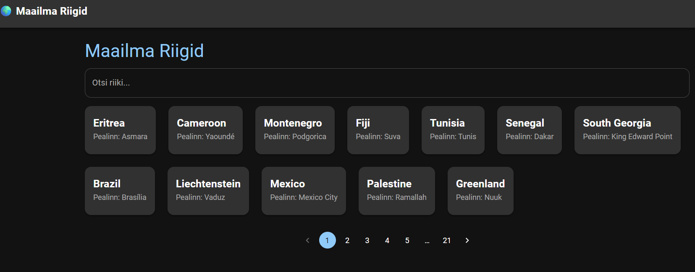
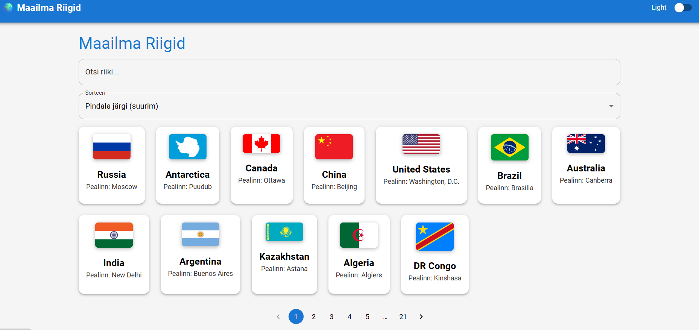

#  Maailma Riigid

**React-põhine veebirakendus**, mis kasutab [REST Countries API](https://restcountries.com/), et kuvada riikide infot interaktiivses ja kasutajasõbralikus kaardivaatena. Rakendus sisaldab otsingut, detailvaateid, pagineerimist, sorteerimist ja teema vahetamist.

---

##  Funktsioonid

- 🔎 Otsi riike nime järgi reaalajas
- 🗂️ Kuvab riikide nimekirja kaardivaatena koos riigilippudega
- 📋 Iga riigi detailne info: **nimi, lipp, pealinn, rahvaarv, pindala, keeled, valuutad**
- 📄 Pagineerimine: 12 riiki lehel
- 🎚️ Sorteerimine: nime, rahvaarvu või pindala järgi
- 🌙 Tume/hele režiimi lüliti (MUI Theme Toggle)
- 🧭 React Router abil navigeerimine detailvaadetesse
- 📱 Materjalipõhine ja responsiivne disain (Material UI)

---

## 🛠️ Kasutatud tehnoloogiad

- ⚛️ React (Vite)
- 🌐 React Router DOM
- 🎨 Material-UI (MUI)
- 🔗 REST Countries API

---

## 🚀 Paigaldamine ja käivitamine lokaalselt

1. **Klooni projekt GitHubist:**

   ```bash
   git clone https://github.com/dmsuho/maailma-riigid.git
   cd maailma-riigid
2. **Paigalda vajalikud sõltuvused:**
    ```bash
    npm install
3. **Käivita arendusserver:**
    ```bash
    npm run dev
4. **Ava veebileht brauseris:**
    http://localhost:5173
    
---

## 📸 Ekraanipildid
- Avaleht 

- Detailvaade 

---

## 👤 Autor

- Dmitri Suhodol
- Õpperühm: EDTR231819
- GitHub: https://github.com/dmsuho